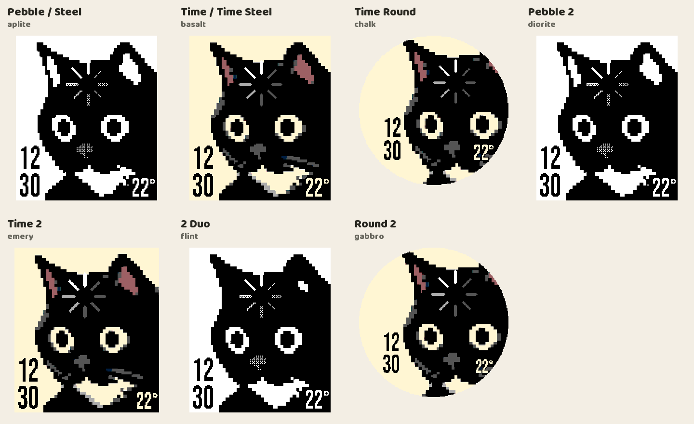

# Loading Cat Digital

A digital variant of ["loading cat" by zbw / zbzbw](https://github.com/zbzbw/loadingcat-pebble). Really like the original, just wanted a digital clock too. Thanks to zbw for the watchface and cat artwork!

[pebble store](https://apps.repebble.com/6f5289e6cd7f4ae7b666cb7f) · [download](https://github.com/jerechinsky/loadingcat-digital/releases/latest)



- **time:** stacked hours and minutes. four fonts: Bebas Neue, Teko, Square and Square Cut. follows the watch's time format, or choose 12/24-hour and a leading zero.
- **temperature:** optional weather from your phone's location or a custom city, in °C or °F. refresh every 15, 30 or 60 minutes. turning it off stops location and weather requests.
- **seconds:** the spinner makes one turn per minute. choose 6, 7, 8, 10 or 12 spokes; timing adjusts automatically (5 seconds per step with 12). seconds mode can be switched off.
- **animation:** flick your wrist for a spin that slows down, then returns to the current seconds position. choose slow or fast, lasting 2, 3 or 4 seconds. default is fast, 3 seconds, 8 spokes. the spinner, animation and individual triggers can be switched off.
- **nighttime:** optionally pause wrist-flick and backlight spins during chosen hours (initially 22:00–07:00). the seconds indicator keeps running.
- **backlight trigger:** can also spin when the backlight wakes on Time 2, 2 Duo and Round 2 with compatible firmware.
- **connection alerts:** optional vibration on disconnect and reconnect, with a separate choice of four patterns for each. both alerts start off. optional white cat on a black background while disconnected; reconnecting restores normal colors. Pebble filters brief drops for about 25 seconds. Ignore Quiet Time applies to both vibration alerts.
- **monochrome:** dithered spinner shading and an optional gray nose.

Works on Pebble, Steel, Time, Time Steel, Time Round, Pebble 2, Time 2, 2 Duo and Round 2. Settings work offline and keep your preferences. For a fixed location, choose **Custom city** and enter **Prague, CZ** (city, two-letter country code). Names such as `Praha, CZ`, `Київ, UA`, `北京, CN` and `東京, JP` work too; `NYC, USA` is accepted. If a name is not found, try its full name or English spelling. Custom mode does not request your phone location. Weather needs internet; stale readings disappear after two hours.

The clock ticks once a minute; the seconds spinner only wakes at each spoke. Animations pause when the face is covered, and disabled triggers unsubscribe. [battery audit](docs/battery-audit.md)

Build with the Pebble SDK:

```sh
pebble build
```

Adapted by **yerex** (jerechinsky on GitHub). Weather: [Open-Meteo](https://open-meteo.com/), CC BY 4.0. Fonts and Clay: [credits and licenses](THIRD_PARTY_NOTICES.md). [upstream license status](UPSTREAM.md) · [privacy](PRIVACY.md) · [technical notes](docs/technical-notes.md)
